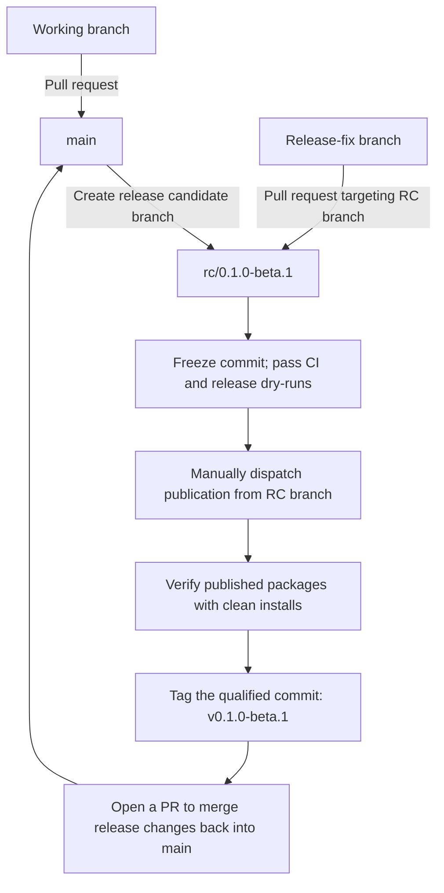

# Contributing to Redact Secret

Redact Secret provides deterministic secret detection and redaction through one
Rust core shared by JavaScript, Python, Rust, and CLI consumers. Beta releases
are prereleases; describe current support and limitations without claiming v1
stability.

## Before opening a change

- Use GitHub Issues for reproducible bugs, compatibility evidence, and focused
  proposals. Public support is best-effort; the project makes no response-time or
  long-term-support commitment.
- Report suspected vulnerabilities privately as described in
  [SECURITY.md](SECURITY.md), not in a public issue.
- Read [ARCHITECTURE.md](ARCHITECTURE.md), [CONVENTIONS.md](CONVENTIONS.md), and the
  [decision router](docs/decisions/DECISIONS.md). A material boundary change needs
  an ADR rather than an undocumented convention.
- New evidence goes where
  [`decision-decide-artifact-taxonomy-spec-routing-and-evidence-placement`](docs/decisions/2026-09-22-decide-artifact-taxonomy-spec-routing-and-evidence-placement.md)
  places its kind, not wherever is convenient: a product-judgement record
  under `docs/audits/evidence/<issue>/`, frozen once written; a benchmark or
  scanner measurement in `redact-secret-benchmarks`, never copied into this
  repository; and an iterative or exploratory log as an issue comment, cited
  by permalink from whichever final record needs it, not restated there.
- Current rules are stated in the five spec files under `docs/specs/`
  (`detector-families.md`, `contextual-detection.md`, `engine.md`,
  `distribution.md`, `evidence-and-gates.md`); each links the ADR that
  decided it. A decision that applies an existing policy to one more
  provider family or one more instance is a spec-file row plus its
  supporting evidence, not a new ADR — a new ADR is warranted only for new
  policy, a new trade-off, or a precedent that spans families.

Keep fixtures to the smallest synthetic input that measures one contract behavior.
Never include active credentials or matched plaintext in diagnostics. Keep the
Rust core side-effect free, detection separate from enforcement, and host I/O in
adapters. Behavior changes need deterministic regressions in the shared
[conformance corpus](conformance/README.md) and explicit false-positive and
false-negative tradeoffs.

## Development checks

For environment setup and a complete local check sequence, see
[developer onboarding](docs/onboarding.md). Public user guides start at
the [documentation home](docs/README.md).

The authoritative commands and pinned tool versions live in
[workspace policy](docs/rust-workspace.md#verification) and
[artifact qualification](docs/qualification.md). Run the checks for every
package you change. Changes to packaging, compatibility, or release behavior also
require artifact inspection and clean-install smoke tests.

Pull requests should explain the observable change, its verification, and any
compatibility impact. By contributing, you agree that your contribution is licensed
under the repository's [MIT License](LICENSE).

### New detector family checklist

Coverage growth is the classic way to lose precision: recall rises, false
positives rise faster, unless every new family arrives with the evidence
that keeps its numbers honest. A detector family does not merge until its
evidence lands with it -- this is a merge gate, not a follow-up, and it is
machine-checked in [`redact-secret-benchmarks`](https://github.com/redact-secret/redact-secret-benchmarks)
by `scripts/check-evidence-arrival.mjs` (`npm run arrival:check`, issue #52
there). Satisfy every item below, in that repository's PR, so the check
passes without anyone having to read the checker script itself:

1. **Provider or tool evidence.** In `benchmarks/lib/assessment.ts`, record
   a `providerSource`, `twinSource`, or `candidateSource` (each a `url`, an
   `observedAt` date, a `formatVersion`, and what it `covers`), or at least
   one `corroboration` entry (`tool`, `label`, `url`), for the family.
   Anything not directly backed by provider documentation is a T2
   (tool-corroborated) contract, not T1, and must say so rather than assert
   provider grounding it doesn't have --
   [`decision-freeze-pulumi-access-token-grammar`](docs/decisions/2026-09-21-freeze-pulumi-access-token-grammar.md)
   shows a T1-prefix/T2-body contract written up this way.
2. **Canonical positives.** At least one fixture carrying the family's
   documented shape in a realistic context, run through the differential
   method against the pinned scanners.
3. **Negative twins.** At least one twin fixture (`twinOf` + `mutation` +
   `mutationKind`) a near-identical non-secret must not flag. Where no
   provider grammar exists to mutate, record
   `contracts["<family>"].unprobeable` with a `reason` and an `observedAt`
   date instead of authoring one -- Datadog's API key, Discord's bot token,
   Twilio's Auth Token and API Key Secret, Telegram's bot token, and
   Microsoft Entra's application client secret already use this escape
   hatch in `benchmarks/support-matrix.json`, each with a reason tied to
   what the provider's page does and doesn't state.
4. **Adversarial benign controls.** At least one control fixture -- a
   public identifier, placeholder, reference, or ordinary prose -- that
   must not be flagged.
5. **Metamorphic cases.** At least one fixture carrying an encoding,
   whitespace, CRLF, Unicode, or chunk-boundary variant
   (`benchmarks/operators/context.ts`).
6. **Mutation cases.** At least one fixture whose prefix, length, alphabet,
   or separator can be mutated (`benchmarks/operators/lexical.ts`).
7. **Differential observation.** At least one fixture assigned to the
   family in `benchmarks/fixture-detectors.json` so it runs against the
   pinned scanners.

**The detector and its contract land together.** The support matrix derives
its family list from the contracts registered in `assessment.ts`, so a
detector merged here without a matching contract in
`redact-secret-benchmarks` isn't `provisional` -- it's invisible to the
support matrix until someone notices the family count is wrong. Coordinate
the product PR and the benchmarks PR to land in the same window rather than
sequencing detector-then-contract; the family identifiers `assessment.ts`
keys its contracts by come from `redact-secret-benchmarks`' own
`benchmarks/support/taxonomy.json`, not from this repository's detector
registry, so a new provider or credential family needs a taxonomy entry
there too before it has an id for the contract to key on.

**This checklist is necessary, never sufficient, for `stable`.** Clearing
it means the evidence *exists*; reaching `stable` in
[`docs/support-matrix.md`](docs/support-matrix.md) also requires the
pass-rate floors `redact-secret-benchmarks`' `benchmarks/support/status-criteria.json`
checks over that evidence (issue #503) -- five twin pairs, five benign
cases, zero unresolved critical mutation or metamorphic findings, zero
unresolved differential contract disagreements, and a T1 positive contract.
A family can clear this checklist and still classify `provisional`; it
cannot classify anything but `provisional` (at best) without clearing this
checklist first.

### Benchmark-originated bug checklist

For a bug found by
[`redact-secret-benchmarks`](https://github.com/redact-secret/redact-secret-benchmarks),
link its benchmark fixture ID, corpus hash, measured candidate identity,
expected and actual safe metadata, finding kind, independent expectation-review
evidence, and product bug issue. Do not change an expectation merely to make a
scanner pass.

Before describing the bug as verified, record both gates in
[`conformance/benchmark-regressions.json`](conformance/benchmark-regressions.json):

- the minimal canonical regression passes every required supported conformance
  surface; and
- the exact fixed candidate was rerun in the benchmark repository and the
  verification evidence is linked.

Follow
[`decision-govern-benchmark-regression-promotion`](docs/decisions/2026-09-18-govern-benchmark-regression-promotion.md)
for fixture placement, detector-unit-test criteria, ownership, and historical
reconciliation. A code fix or a closed implementation issue alone does not
satisfy both gates.

During beta, repository Markdown is the documentation source. Include updates
to the relevant user guides, examples, support statements, and limitations in
each feature change. Use the [documentation readiness checklist](docs/documentation-readiness.md)
to identify affected topics and record verification evidence. Before stable
release, reconcile all required topics with the final public contracts and
complete the delivery checks after a platform has been chosen.

## Branching strategy

`rc` stands for release candidate. `main` is the integration branch. Merge normal
development from working branches through pull requests. When a release is ready
for stabilization, create `rc/<version>` from the reviewed main commit, for
example `rc/0.1.0-beta.1`.

- Keep version preparation, release notes, and candidate fixes on `rc/<version>`.
  Target release-fix PRs at that branch; keep unrelated development on `main`.
- There is no intermediate `release/v*` branch. Each release uses its own RC
  branch, whose version must exactly match the product manifests.
- PR merges do not publish packages or create tags. After qualification and
  explicit release approval, manually dispatch [Release](.github/workflows/release.yml)
  from the RC branch. The protected `release` environment permits RC branches.
- Freeze the candidate commit during qualification and publication. Any source
  change requires fresh qualification. The workflow creates the immutable,
  annotated version tag on the qualified commit only after publication and
  registry-install verification succeed.
- After publication, merge release changes back into `main` through a reviewed
  PR and retain the RC branch as the preparation and recovery record.
- [Reconcile Release](.github/workflows/reconcile-release.yml) requires separate
  authorization and runs from the matching RC branch. Its source must remain
  in that branch's history; merging into `main` is not a repair prerequisite.
- When PyPI already has a matching proper subset of the qualified wheels and
  source distribution, `Reconcile Release` verifies every existing file by
  SHA-256, downloads the original qualified artifacts, stages only the missing
  files, and publishes those files on an authorized non-dry-run. Conflicting
  files, unreadable registry state, or expired original artifacts block
  recovery. A dry run prints the missing PyPI filenames without publishing.

## Releases

Follow the [release runbook](docs/releasing.md) for candidate preparation,
non-publishing qualification, approval, publication, recovery, and closeout.

The Rust crates, npm packages, Python distribution, and CLI share one SemVer
version, source revision, and eventual `v{version}` tag. Follow the
[release authority](AGENTS.md#release-authority),
[lockstep decision](docs/decisions/2026-09-09-release-bindings-in-lockstep.md), and
[artifact qualification guide](docs/qualification.md). Publishing one artifact
does not establish that the whole product has been released. Partial publication
requires separately authorized [Reconcile Release](.github/workflows/reconcile-release.yml)
using the durable release manifest and matching qualified artifacts.

### Release evidence

[Release status](docs/releases/status.md) lists every published version and
its durable record. Subsequent development is recorded under `Unreleased` in
the [changelog](CHANGELOG.md). Candidate reviews live under
[docs/audits](docs/audits/README.md); their verification is not approval to
publish.
