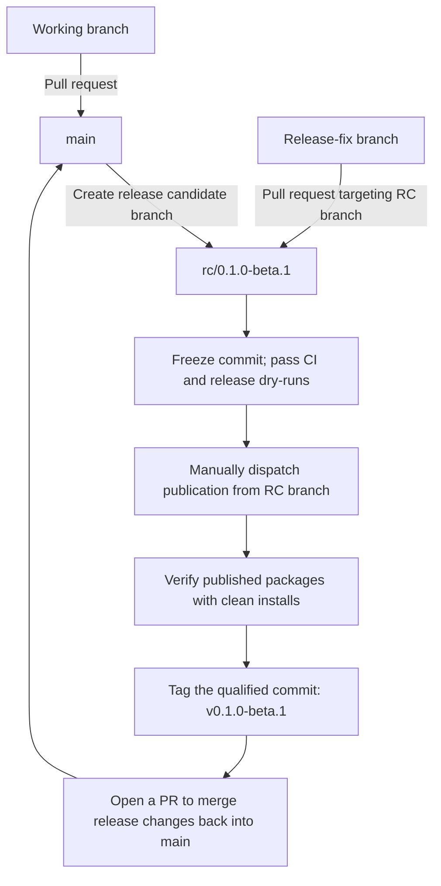

# Contributing to Redact Secret

Redact Secret provides deterministic secret detection and redaction through one
Rust core shared by JavaScript, Python, Rust, and CLI consumers. The first beta
is a prerelease; describe current support and limitations without claiming v1
stability.

## Before opening a change

- Use GitHub Issues for reproducible bugs, compatibility evidence, and focused
  proposals. Public support is best-effort; the project makes no response-time or
  long-term-support commitment.
- Report suspected vulnerabilities privately as described in
  [SECURITY.md](SECURITY.md), not in a public issue.
- Read [ARCHITECTURE.md](ARCHITECTURE.md), [CONVENTIONS.md](CONVENTIONS.md), and the
  [decision router](docs/decisions/DECISIONS.md). A material boundary change needs
  an ADR rather than an undocumented convention.

Keep fixtures to the smallest synthetic input that measures one contract behavior.
Never include active credentials or matched plaintext in diagnostics. Keep the
Rust core side-effect free, detection separate from enforcement, and host I/O in
adapters. Behavior changes need deterministic regressions in the shared
[conformance corpus](conformance/README.md) and explicit false-positive and
false-negative tradeoffs.

## Development checks

For environment setup and a complete local check sequence, see
[developer onboarding](docs/onboarding.md). Public user guides start at
the [documentation home](docs/README.md).

The authoritative commands and pinned tool versions live in
[workspace policy](docs/rust-workspace.md#verification) and
[artifact qualification](docs/qualification.md). Run the checks for every
package you change. Changes to packaging, compatibility, or release behavior also
require artifact inspection and clean-install smoke tests.

Pull requests should explain the observable change, its verification, and any
compatibility impact. By contributing, you agree that your contribution is licensed
under the repository's [MIT License](LICENSE).

During beta, repository Markdown is the documentation source. Include updates
to the relevant user guides, examples, support statements, and limitations in
each feature change. Use the [documentation readiness checklist](docs/documentation-readiness.md)
to identify affected topics and record verification evidence. Before stable
release, reconcile all required topics with the final public contracts and
complete the delivery checks after a platform has been chosen.

## Branching strategy

`rc` stands for release candidate. `main` is the integration branch. Merge normal
development from working branches through pull requests. When a release is ready
for stabilization, create `rc/<version>` from the reviewed main commit, for
example `rc/0.1.0-beta.1`.

- Keep version preparation, release notes, and candidate fixes on `rc/<version>`.
  Target release-fix PRs at that branch; keep unrelated development on `main`.
- There is no intermediate `release/v*` branch. Each release uses its own RC
  branch, whose version must exactly match the product manifests.
- PR merges do not publish packages or create tags. After qualification and
  explicit release approval, manually dispatch [Release](.github/workflows/release.yml)
  from the RC branch. The protected `release` environment permits RC branches.
- Freeze the candidate commit during qualification and publication. Any source
  change requires fresh qualification. The workflow creates the immutable,
  annotated version tag on the qualified commit only after publication and
  registry-install verification succeed.
- After publication, merge release changes back into `main` through a reviewed
  PR and retain the RC branch as the preparation and recovery record.
- [Reconcile Release](.github/workflows/reconcile-release.yml) requires separate
  authorization and runs from the matching RC branch. Its source must remain
  in that branch's history; merging into `main` is not a repair prerequisite.
- When PyPI already has a matching proper subset of the qualified wheels and
  source distribution, `Reconcile Release` verifies every existing file by
  SHA-256, downloads the original qualified artifacts, stages only the missing
  files, and publishes those files on an authorized non-dry-run. Conflicting
  files, unreadable registry state, or expired original artifacts block
  recovery. A dry run prints the missing PyPI filenames without publishing.

## Releases

The Rust crates, npm packages, Python distribution, and CLI share one SemVer
version, source revision, and eventual `v{version}` tag. Follow the
[release authority](AGENTS.md#release-authority),
[lockstep decision](docs/decisions/2026-09-09-release-bindings-in-lockstep.md), and
[artifact qualification guide](docs/qualification.md). Publishing one artifact
does not establish that the whole product has been released. Partial publication
requires separately authorized [Reconcile Release](.github/workflows/reconcile-release.yml)
using the durable release manifest and matching qualified artifacts.

### First beta candidate

The preparation branch is `rc/0.1.0-beta.1`. The existing manifests already
agree on `0.1.0-beta.1` (Python distribution metadata: `0.1.0b1`). The
[candidate changelog](CHANGELOG.md) records the public contract; this is not
a publication record or permission to publish.

Before requesting final release approval:

- Complete stabilization on `rc/0.1.0-beta.1` using the branch path above.
- Resolve or explicitly disposition the residual findings in the
  [latest readiness audit](docs/audits/repeated-release-readiness-audit.md#blocking-residual-findings-and-exact-exits):
  partial-publication recovery, complete failed-run manifests, review and
  qualification protection, publisher prerequisites, and SAST ownership.
  Closed tracking issues and green CI alone do not resolve these findings.
- Review the candidate version, public API, and changelog; run CI, Python
  wheels, artifact qualification, and SAST against the final source revision.
  Any further commit needs fresh qualification for that revision.
- Obtain explicit release approval after those checks. Publish through the
  approved workflow, verify registry installs, and retain the release manifest.
  Use reconciliation only with separate authorization.
