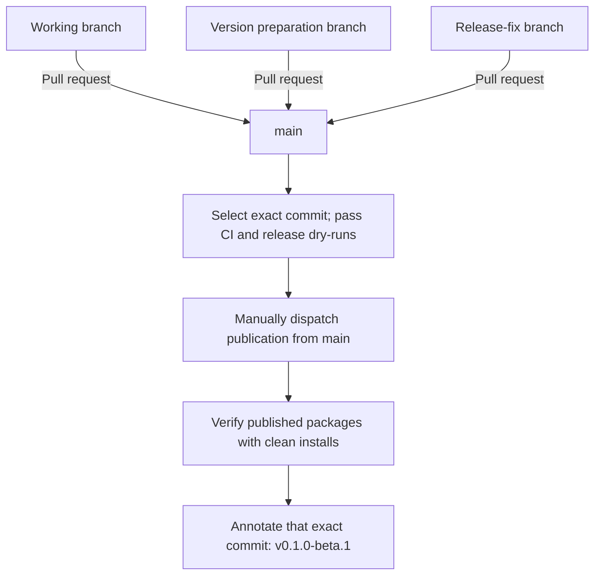

# Releasing Redact Secret

[Documentation home](README.md) · [Contribution guide](../CONTRIBUTION.md)

Use this runbook after feature work is reviewed, for candidate preparation,
qualification, publication, recovery, and closeout. It describes the workflows
in this repository; [AGENTS.md](../AGENTS.md#release-authority) remains the
release authority. A completed issue or successful build is not release approval.

Nothing but that explicit approval authorizes a release. Readiness checks,
qualification runs, assessment results, audits, checklists, a manifest
version value, and completed issues are evidence only: none of them selects a
version, creates a tag or a GitHub Release page, publishes a package,
deploys, or archives another repository. Documents elsewhere in this
repository link here rather than restating this rule.

Published versions and their evidence are listed in
[release status](releases/status.md). Use the candidate's own source revision
and review evidence when preparing the next release.

## TL;DR: which workflow do I run

All three are manual (`workflow_dispatch`) — nothing here fires on its own.
`Release` and `Reconcile Release` share the `npm-release` concurrency group,
so they queue and run one at a time; they never race each other.

| | Package Release Rehearsal | Release | Reconcile Release |
| --- | --- | --- | --- |
| What it does | Packs and checks npm runtime dependency packages only | Publishes to crates.io, npm, and PyPI for real, then tags | Repairs a **partially** failed `Release`: fills in only what's missing |
| Publishes anything? | No — nothing is ever published | Yes, everything | Only what the failed run didn't already publish |
| When to run it | Optional, while preparing the release commit | Once, after final approval | Only after a `Release` run fails partway, with separate recovery authorization |
| Has a dry-run? | It *is* the dry-run | No — there is no rehearsal mode for `Release` itself | Yes: `dry_run=true` prints the plan before anything is touched |

Normal path:

```
merge the prepared version to main
  → (optional) Package Release Rehearsal   -- npm dependency check only, publishes nothing
  → Artifact qualification + SAST + approval
  → Release                                -- the actual publish, run once
       success      → close out
       partial fail → Reconcile Release (dry_run=true, review the plan, then dry_run=false)
```

`Reconcile Release` is not a second attempt at a normal release and is not
interchangeable with re-running `Release`: re-running `Release` can fail hard
on packages that already published successfully, since most registries reject
publishing over an existing version. Details on why to prefer each workflow,
and what evidence each requires, are in the sections below.

## Branching model

`main` is both the integration branch and the only release source. Normal
development, version preparation, and release fixes merge into it from working
branches through reviewed pull requests. Qualification and publication operate
on an exact `main` commit SHA; a moving branch name never identifies a release.



- Merge version preparation, release notes, and release fixes into `main`
  through reviewed pull requests. There is no intermediate release or RC branch.
- PR merges do not publish packages or create tags. After qualification and
  explicit release approval, manually dispatch
  [Release](../.github/workflows/release.yml) from `main`. The protected
  `release` environment permits `main`.
- Record the exact qualified `main` commit before publication. Later commits on
  `main` do not change the workflow's immutable `github.sha`; any source change
  selected for release requires fresh qualification. The workflow creates the
  annotated version tag at that exact SHA only after publication and
  registry-install verification succeed. The peeled tag commit is the
  canonical released source identity.
- [Reconcile Release](../.github/workflows/reconcile-release.yml) requires
  separate authorization and runs from `main`. Its recorded source must remain
  in `main` history.
- When PyPI already has a matching proper subset of the qualified wheels and
  source distribution, `Reconcile Release` verifies every existing file by
  SHA-256, downloads the original qualified artifacts, stages only the missing
  files, and publishes those files on an authorized non-dry-run. Conflicting
  files, unreadable registry state, or expired original artifacts block
  recovery. A dry run prints the missing PyPI filenames without publishing.

## Product and artifact identity

All product packages share one SemVer version and source revision. Python uses
the equivalent PEP 440 spelling, for example `0.1.0-beta.2` becomes `0.1.0b2`.
The version examples here do not authorize selecting or publishing them.

| Registry or delivery surface | Artifact |
| --- | --- |
| npm | `@redact-secret/core` facade |
| npm | `@redact-secret/wasm` runtime |
| npm | Eight `@redact-secret/node-<platform>` runtime packages, including two musl |
| crates.io | `redact-secret` library and `redact-secret-cli` CLI crate |
| PyPI | `redact-secret` distribution: eight abi3 wheels and one sdist |
| Actions qualification artifacts | Six native CLI binaries |

There are ten npm package identities, two crate identities, and one Python
distribution across three registries. Both musl Node addons are published to
npm (`decision-publish-musl-node-addons`); the CLI still ships no musl binary.
The exact matrices belong to
`Cargo.toml`'s `[workspace.metadata.redact-secret]`; see
[qualification](qualification.md) and [Python packaging](python-packaging.md).

`@redact-secret/wasm` carries two built artifacts under one package identity:
the unchanged root (`full`) glue and `.wasm`, and a `common` subpath shipping
the opt-in `common`-profile build's own glue and `.wasm` beside them. One
pack/publish step covers both. Before publishing, the workflow instantiates
the downloaded root artifact and asks it — rather than trusting the download's
artifact name — that `profile() === "full"`, refusing to publish a `common`
or otherwise non-`full` build under the `full`/default package identity. See
[detector profiles](reference/api-contract.md#detector-profiles).

The workflows create an annotated Git tag after verification. They do not
automatically create a GitHub Release or attach CLI binaries to one. A GitHub
Release or another distribution channel needs an explicit publication decision
and must use the qualified binaries and recorded digests.

## Prepare the candidate

1. Review the integration commit on `main`, the open defects, public exports,
   supported runtimes, compatibility changes, and `Unreleased` changelog.
2. After candidate-version approval, prepare manifests, lockfiles, changelog,
   and release notes on a working branch, then merge them into `main` through a
   reviewed pull request. Release fixes follow the same path.
3. Update the workspace Cargo version, every version-bearing JSON manifest,
   exact npm runtime dependencies, and Cargo/npm lockfiles together. Python
   derives its version dynamically from Cargo. Use the
   [lockstep policy](rust-workspace.md#version-lockstep) for the complete set.
   Preserve historical release records and examples intentionally pinned to them.
   Update the version pins and expected output in
   [`docs/quickstart.md`](quickstart.md) too; the `clean-install` job fails on
   a page that does not pin the candidate version.
4. Run the local checks below before merging. After merge, record the exact
   `main` commit to qualify. Selecting any later source commit requires fresh
   qualification.

```bash
npm ci --ignore-scripts
npm run ci
npm run rust:check
cargo fmt --all --check
cargo clippy --workspace --all-targets --locked -- -D warnings
cargo test --workspace --locked
```

From the prepared `main` checkout, derive the version and record the source SHA:

```bash
RELEASE_VERSION=$(node -p "require('./packages/javascript/package.json').version")
test "$(git branch --show-current)" = main
python3 -B scripts/check-release-refs.py --candidate-ref refs/heads/main
RELEASE_SOURCE_SHA=$(git rev-parse HEAD)
```

This reads an already-approved version; it does not choose one. Record the full
commit SHA alongside all subsequent workflow run IDs.

## Qualify without publication

Inspect workload inputs before expensive runs. Conformance tests use the
smallest fixtures that exercise the behavior; performance profiles measure
resource use separately. A large performance workload is not needed to prove
a lifecycle or packaging contract.

Main pushes trigger qualification. Reuse a successful full run for the selected
revision, or dispatch it explicitly when needed:

```bash
gh workflow run artifact-qualification.yml --ref main
gh workflow run package-release-rehearsal.yml --ref main
gh run list --branch main --limit 20
```

`Artifact qualification` includes reusable CI and Python-wheel workflows,
native/browser/CLI qualification, installed JavaScript consumers, and an
`artifact-inventory` upload. Check the run's `headSha` against the frozen SHA,
every required job, and the inventory's source, version, corpus hashes, artifact
digests, and installed-consumer reports. A PR run that only checks changed
workflow declarations is not full candidate qualification.

`Package Release Rehearsal` packs and checks npm runtime dependencies and
records `dependency-cutover-plan`. It publishes nothing. It is an npm dependency
rehearsal, not a simulated publication to all registries. It qualifies a
throwaway `<X.Y.Z>-beta.<run id>` version that no registry carries, moved onto
its own uncommitted checkout, so unpublished-version defects surface before an
RC exists (what that covers:
[release rehearsal coverage](audits/release-rehearsal-coverage.md#rehearsing-at-a-throwaway-unpublished-version)). `Release` has no
`publish=false` or `dry_run` input; never dispatch it as a rehearsal.

Also require passing SAST evidence for the frozen revision. An acknowledged
baseline is not zero findings or complete parser coverage. Assessment results
remain separate from conformance: use the prepared profiles and applicable
environment in [assessment](../assessment/README.md). The manually dispatched
`complete-assessment.yml` runs the measurement suite as a smoke check only; it
performs no acceptance judgement and is not wired as a Release dependency.
Performance results, release acceptance criteria, and judgement are owned by
[`redact-secret-benchmarks`](https://github.com/redact-secret/redact-secret-benchmarks),
not this repository (issue #603), and a threshold measured for one host does
not establish acceptance on another host.

`Artifact qualification` also runs the [support-matrix drift
gate](support-matrix-drift.md) (issue #511): it fails the run on a family
that regressed out of `stable` since the most recent prior release unless
`benchmarks/support-matrix-drift-acknowledgements.json` already carries an
explicit, rationale-bearing override for it. Refresh
`benchmarks/support-matrix.json` from a `redact-secret-benchmarks` run
measured against this candidate's published-artifact evidence path (issue
#508's distinction) before qualification, not from a local build.

## Review and approval

Before requesting final release approval for v0.1.0 stable, check the
candidate against the [v0.1.0 release-readiness checklist](releases/release-readiness-v0.1.0.md).
It states, per criterion, what "release engineering is ready" means and how
to check it against this run; it does not itself approve anything.

Before requesting final release approval, assemble a reviewable record of:

- Approved version, full `main` source SHA, public API review, compatibility
  changes, changelog, and disposition of every release-blocking issue.
- Exact-revision qualification, rehearsal, SAST, artifact inventory, and any
  applicable assessment evidence. Hashing an old review document does not make
  it a current API review.
- Live `release` environment reviewers and `main` branch restriction; repository
  review/status/tag rules; npm and crates.io publisher rights; PyPI Trusted
  Publisher identity for this repository, workflow, and environment.

`npm run registry-preflight:check` reads public registry/repository metadata.
It does not prove that publishing credentials work. The read-only
`scripts/verify-release-governance.py` can inspect the `release` environment
and branch settings; account-level publishing rights need separate verification.
Never record token values in release evidence.

Beta.1's Actions token could not create the tag reference (HTTP 403); its
[release record](releases/0.1.0-beta.1/README.md) documents the authorized recovery.
Check tag-writing authority before publication. Do not bypass repository rules
or assume `contents: write` alone proves that the tag operation is permitted.

Obtain explicit user release approval after tests, API review, and changelog
review pass. Environment approval is an additional workflow boundary.

## Publish the approved revision

After approval, confirm the selected SHA is still the qualified `main` source
and dispatch the one product workflow from `main`:

```bash
gh workflow run release.yml --ref main
gh run list --workflow release.yml --branch main --limit 5
```

Inspect the new run's SHA before approving its protected jobs. The workflow
repeats qualification at that revision. It publishes native/Wasm npm dependencies
before the facade; publishes the core crate before the CLI crate; and uploads
the qualified Python wheel/sdist files. Prerelease npm packages use `beta`,
stable packages use `latest`.

The post-publication jobs clean-install the exact npm version on all eight
native Node platforms (the two musl lanes run in `node:22-alpine` containers)
and Chromium. `tag-release` waits for publication and those install
checks, then creates annotated `v<version>` at the immutable workflow source
SHA. Resolve `v<version>^{commit}` to recover the canonical released source. The
current graph has no equivalent post-publication Rust/Python clean-install
matrix: retain their registry file/checksum evidence and verify exact-version
consumer installation separately before claiming that broader verification.

`record-manifest` attempts to run even after failed publishers and uploads
`release-manifest-<version>`. It records source revision, corpus identity,
version, expected artifact identities, observed registry states, and (issue
#511) the [support-matrix drift](support-matrix-drift.md) record `Artifact
qualification` computed for this candidate. Its success does not establish
tag or registry-install success: those jobs are separate.

## Recover a partial publication

Stop and record the exact failed run, source, version, available qualified
artifacts, manifest, and live registry state. A timeout or HTTP error does not
prove absence. Never overwrite a published version or move its tag.

With separate explicit recovery authorization, use `Reconcile Release` from
`main`. First compute a non-publishing plan:

```bash
gh workflow run reconcile-release.yml --ref main \
  -f version="$RELEASE_VERSION" -f dry_run=true
```

The workflow locates the latest unexpired matching release manifest. Check its
source/run identity. When the manifest upload failed, provide both
`source_commit` and `source_run` explicitly to identify the original Release
run and qualified inventory. The selected source must remain in the current
`main` history, including its tip. A source outside that history cannot be
recovered through this path.

Review the exact skip/publish/block plan and evidence before authorizing
`dry_run=false`. Existing artifacts must match the qualified content; missing
compiled artifacts come from the original run, not a new build. Expired
artifacts, content conflicts, or unknown registry state require resolution
before proceeding. A full Release retry is not a general recovery mechanism:
some publishers reject an already-published version.

Registry lookup failures remain `unknown` and block recovery planning rather
than being inferred as unpublished; [#238](https://github.com/redact-secret/redact-secret/issues/238)
records the fix and deterministic regressions. Independently verify live state
before any recovery action.
Preserve all recovery run IDs and verification outcomes; the recovery workflow
does not write a replacement durable release manifest.

## Close out

Preserve evidence under `docs/releases/<version>/`, following the
[beta.1 record](releases/0.1.0-beta.1/README.md): approved source, artifact and
corpus identity, registry file checksums, qualification/publication/recovery run
IDs, clean-install results, and annotated tag target. Label reconstructed
evidence explicitly if an automated manifest failed. Copy necessary evidence
before Actions artifacts expire.

Update the dated changelog entry and public installation guidance to reflect
what actually published through a reviewed pull request to `main`. A release is
complete only when the
intended artifact set, verification, tag, and evidence agree; partial success
must remain visible as partial success.

If `benchmarks/support-matrix.json` changed since the previous release (see
[the support matrix](support-matrix.md) and issue #510), include its status
distribution and what moved in the dated changelog entry, generated -- never
hand-written -- with:

```bash
python3 -B scripts/generate-support-matrix-docs.py --release-note \
  --previous <(git show "v$PREVIOUS_VERSION:benchmarks/support-matrix.json")
```

The fragment states a delta only against a like-for-like baseline: the
published previous release measured at the same `redact-secret-benchmarks`
revision as the candidate matrix. A `--previous` matrix from an earlier tag
was normally measured under an earlier corpus and ledger, so the fragment then
says it is not comparable and states no delta. Commit the fragment as
`docs/releases/$RELEASE_VERSION/support-status.md` and copy it into the dated
changelog entry as its `### Support status` section. `npm run
support-matrix:check` (in `npm run ci`) fails when the two differ (#724).

Run the deterministic, offline durable-record check before opening the
closeout PR:

```bash
python3 -B scripts/validate-release-records.py --version "$RELEASE_VERSION"
```

The checked-in record must contain `README.md`, the original
`artifact-inventory.json`, and a final `manifest.json`. The validator ties the
directory, version, source revision, conformance identity, artifact set,
registry checksums, clean-install runs, and annotated tag together and requires
the dated changelog entry to link the record. A reconstructed manifest must be
explicitly labeled and retain the original partial manifest plus every recovery
run needed to explain the final state. It cannot replace an `unknown` or
`unpublished` final registry state with an assertion lacking provenance.

A successful publication workflow or annotated tag is not release completion.
Completion requires this check to pass in a reviewed closeout PR that is merged
to `main`.
